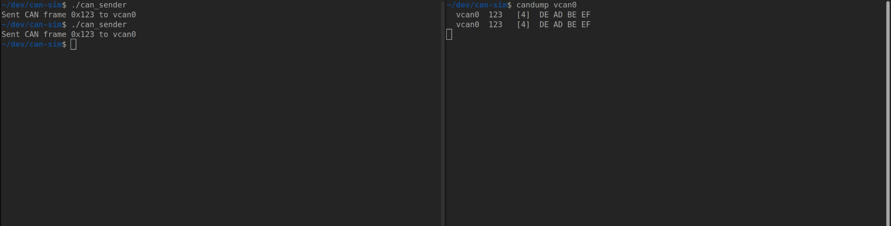
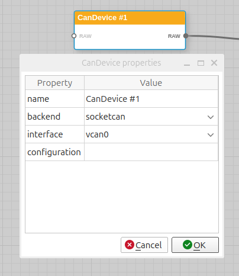
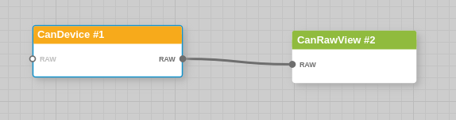
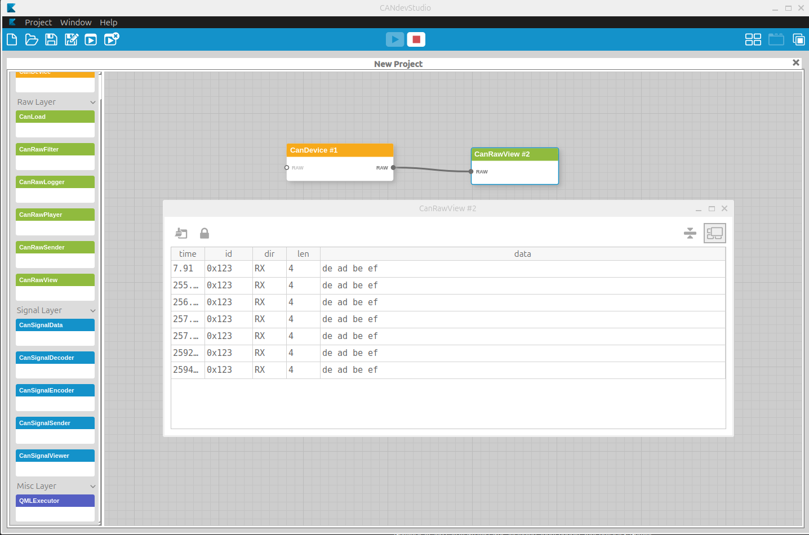

# README.md

This guide describes how to setup a virtual CAN network on Linux, configure CANdevStudio as a simulator, and interact with it using a custom C++ application.

## 1. System Setup
### Install Dependencies
To build CANdevStudio and use CAN utilities, install the following packages on your Ubuntu/Debian system:

```bash
sudo apt update
sudo apt install can-utils
sudo apt install qtbase5-dev libqt5serialbus5-dev libqt5svg5-dev qtdeclarative5-dev
```
Note: These dependencies are required for the Qt-based CAN interface and the SVG components of the simulator.

### Create a Virtual CAN Interface (vcan0)
Run these commands to create a virtual bus in the Linux kernel:

```bash
sudo modprobe vcan
sudo ip link add dev vcan0 type vcan
sudo ip link set vcan0 up
#verify
ip link show vcan0
```

Output:
```text
17: vcan0: <NOARP,UP,LOWER_UP> mtu 72 qdisc noqueue state UNKNOWN mode DEFAULT group default qlen 1000    link/can 
```

## 2. Build CANdevStudio
Follow these steps to clone and compile the simulator from source:

```bash
git clone https://github.com/GENIVI/CANdevStudio.git
cd CANdevStudio
git submodule update --init --recursive
mkdir build && cd build
cmake ..
time make -j$(nproc)
```

```text
real	5m33.084s
user	32m50.147s
sys	2m12.142s
```
Note: The submodule update is important to include the necessary UI components and libraries.

## 3. C++ Application Code
Create a file named `can_sender.cpp`. This application sends a raw CAN frame to the vcan0 interface.

```cpp
#include <iostream>
#include <cstring>
#include <unistd.h>
#include <net/if.h>
#include <sys/ioctl.h>
#include <sys/socket.h>
#include <linux/can.h>
#include <linux/can/raw.h>

int main() {
    int s;
    struct sockaddr_can addr;
    struct ifreq ifr;
    struct can_frame frame;
    // Create Socket
    s = socket(PF_CAN, SOCK_RAW, CAN_RAW);
    // Bind to vcan0
    std::strcpy(ifr.ifr_name, "vcan0");
    ioctl(s, SIOCGIFINDEX, &ifr);
    addr.can_family = AF_CAN;
    addr.can_ifindex = ifr.ifr_ifindex;
    bind(s, (struct sockaddr *)&addr, sizeof(addr));
    // Prepare Frame (ID: 0x123, Data: DE AD BE EF)
    frame.can_id = 0x123;
    frame.can_dlc = 4;
    frame.data[0] = 0xDE;
    frame.data[1] = 0xAD;
    frame.data[2] = 0xBE;
    frame.data[3] = 0xEF;
    // Send
    write(s, &frame, sizeof(struct can_frame));
    std::cout << "Sent CAN frame 0x123 to vcan0" << std::endl;
    close(s);
    return 0;
}
```

## 4. Compile app

```bash
g++ can_sender.cpp -o can_sender
```

## 5. Execution Sequence
### Using candump

To verify the setup, follow this specific order: 

Run in terminal #1:

```bash
~/dev/can-sim$ candump vcan0
```

Run app in terminal #2: 

```bash
~/dev/can-sim$ ./can_sender 
Sent CAN frame 0x123 to vcan0
```

Verify terminal #1:

```bash
~/dev/can-sim/CANdevStudio$ candump vcan0
  vcan0  123   [4]  DE AD BE EF
```
 

### Using CANDevStudio (GENIVI)

1. **Start the Simulator:** 

   Run `./build/src/gui/CANdevStudio`.
2. **In the UI:**
   Drag a CanDevice component.
3. **Configure it:**
   backend: socketcan, interface: vcan0. 

 

4. **Connect:**
   Drag a CanRawView and connect it to the device output (connected via a line). 

 

5. **Start:**
   Click the Start Simulation button.
6. **Run the App:**
```bash
./can_sender
```
8. **Verify:**
   Check the CanRawView window (double-click on CanRawView object) in CANdevStudio. You should see the message 123 [4] DE AD BE EF appearing instantly. 

 


